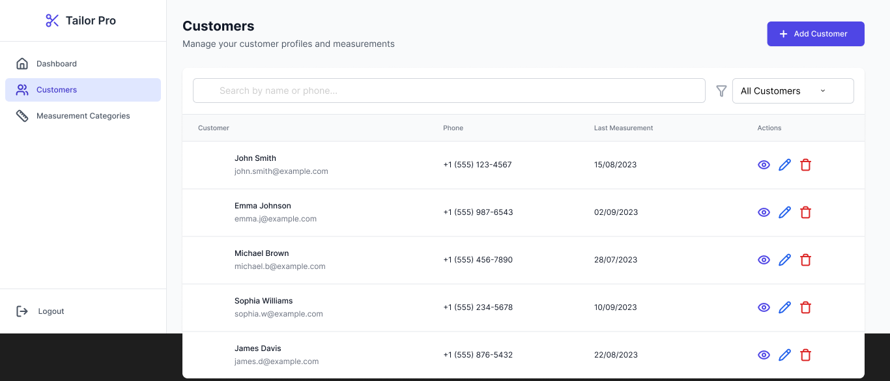
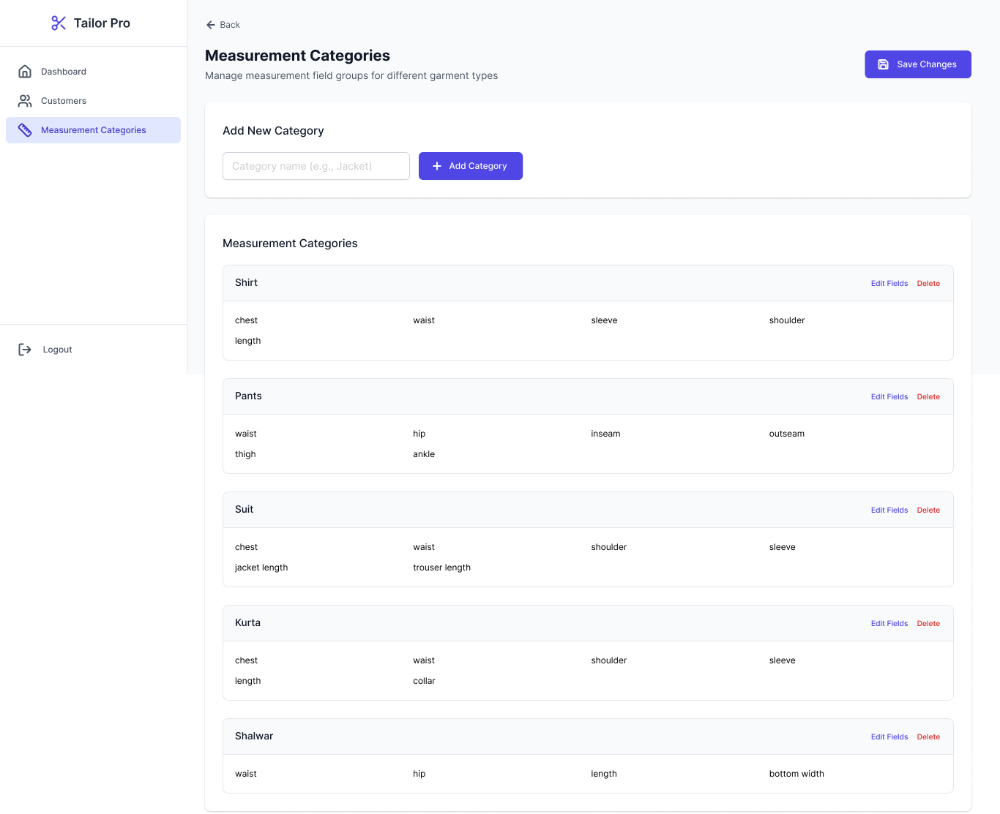

# Wireframes

Use this folder to store screenshots/exports of your wireframes and links to design sources.

## Figma / Design Links

- Link: [Tailor Admin Portal Wireframes (Figma)](https://www.figma.com/proto/yzCShiLbWqwBQFzsHFAtrc/Tailor-Admin-Portal?node-id=4-336&t=dWOzkVqXr8ys5Jkx-0&scaling=min-zoom&content-scaling=fixed&page-id=0%3A1&starting-point-node-id=4%3A336)
- Version/Note: <optional>

## Screens (add images or PDFs)

Below images will render if the files exist in this folder:






You can drag-and-drop images into this folder. If you prefer HTML for sizing, you can use:

```html

```

## Notes

- Keep filenames descriptive and kebab-cased.
- Prefer PNG/JPG for quick sharing; use PDF for printable flows.
- Update links when the source design changes.
